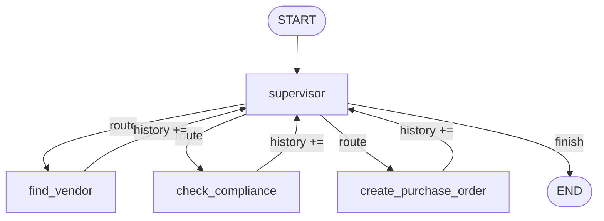
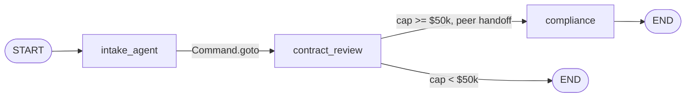
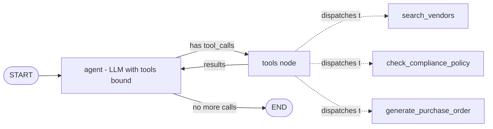
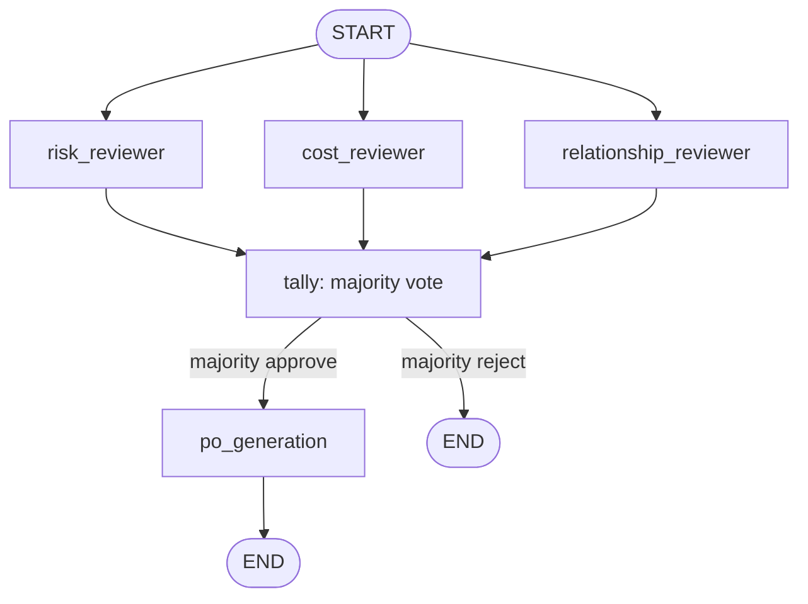

# Module comparison: pros, cons, and what to actually use in production

Read [[Home]] first for vocabulary. This page assumes you've at least
skimmed all four modules' exercise files in the
[repo](https://github.com/psppravin28-dev/multi-agent-orchestration) —
it compares them rather than teaching any one of them from scratch.

## The four shapes, side by side

Same four specialists throughout (`vendor_sourcing` / `contract_review`
/ `compliance` / `po_generation`, or a subset of them per exercise).
Only the wiring changes.

### Module 1 — Hierarchical delegation

One node re-evaluates after every step. A **separate router function**
reads its decision and picks the next hop.

### Module 2 — Handoff patterns

No router function. Each node's `Command` return **is** the edge, and
control can move sideways between peers without ever returning to
`intake_agent`.

### Module 3 — Specialist network

No router, no `Command`. The model's own native tool-calling decides
which specialist(s) to invoke, how many times, in what order — nothing
in the graph constrains the sequence.

### Module 4 — Swarm intelligence

Three independent agents run **concurrently**, each reaching its own
verdict with no visibility into the others. Only a tally node combines
them — no single agent's answer is authoritative by itself.

## Pros and cons

### Module 1 — Hierarchical delegation

**Pros**
- Every possible destination is explicit in one dict
  (`add_conditional_edges`) — auditing "what can this system do" means
  reading one function.
- One policy chokepoint: guardrails, logging, and rate limits all have
  exactly one place to live.
- The loop variant handles genuinely *sequential* multi-step work
  (compliance → PO) without the caller orchestrating it.

**Cons**
- The supervisor is a bottleneck — every hop costs an LLM round-trip
  through it, even when a specialist could obviously decide the next
  step itself.
- Prone to scope creep: in this repo's own Exercise 3, a request that
  only asked to find vendors also triggered an unrequested compliance
  check, because the loop's prompt didn't explicitly bound "finish."
- Doesn't scale gracefully — the supervisor's prompt has to describe
  every specialist, so misrouting risk grows with the option count.

### Module 2 — Handoff patterns

**Pros**
- No bottleneck — the agent that discovers something acts on it
  directly (`contract_review` escalating to `compliance` on its own).
- Less code per hop — `Command` collapses "compute" and "route" into one
  return value.
- Matches how real workflows move (a ticket: support → billing → legal),
  not always back through a dispatcher.

**Cons**
- Harder to audit *globally* — "everything this system can do" is
  scattered across every node's own `Command.goto`, not one dict.
- No built-in loop guard — two agents handing off back and forth is a
  real risk Module 1's `MAX_DELEGATIONS` explicitly protected against.
- Harder to unit test — a node's logic now includes routing, so you
  can't test "what it computes" separately from "where it sends
  control."

### Module 3 — Specialist network

**Pros**
- Most flexible — the model composed "search vendors, then check
  compliance on the top one" without anyone coding that specific
  sequence.
- Least orchestration code — no router, no `Command` logic, just tool
  definitions plus one generic agent/tools loop.
- Composable — a "specialist" tool can itself be a nested agent (Exercise
  2), invisible to its caller, so depth doesn't bloat the top-level
  prompt.

**Cons**
- Least predictable — sequence, call count, and order can vary run to
  run, the same risk class as any tool-calling agent.
- Business rules aren't guaranteed unless pushed *into* the tool itself
  (as Exercise 2 does for compliance) — forget that, and the orchestrator
  can simply skip a required step.
- Debugging feels like debugging a conversation, not a graph — there are
  no fixed edges to reason about, only whatever the model decided at
  runtime.

### Module 4 — Swarm intelligence

**Pros**
- Redundancy against one agent's mistake — this repo's own consensus
  example is a dissenting reviewer correctly getting overruled by
  majority.
- True parallelism — N independent evaluations run concurrently, so
  latency doesn't scale linearly with N.
- Fits naturally where the real-world process already is
  many-judgments-combined: risk review, scoring, moderation.

**Cons**
- Most expensive pattern — N parallel LLM calls per decision instead of
  1 (the consensus exercise makes 3 calls where Module 1 would make 1).
- Consensus logic is itself new business logic to design correctly —
  majority? unanimous? weighted? — not free.
- Overkill for a clear-cut deterministic check; you don't need three
  reviewers to know $500 is under a $50k threshold.

## Which one is "most production-ready"?

There isn't a single winner — production systems generally end up
**combining these patterns per decision type**, not picking one
globally. But here's the reasoning, weighed against real production
constraints:

**Cost and latency.** Module 4 multiplies LLM calls (3x+ per decision)
— real money and real wall-clock time at scale, though the fan-out does
run concurrently, so it isn't 3x *latency*, just 3x *cost*. Module 3's
call count is unbounded and run-to-run variable, which makes both cost
and latency hard to forecast. Modules 1 and 2 have the most predictable
call counts per request.

**Testability and auditability.** This matters more than it sounds like
it should, especially in a regulated domain like procurement. Module
1's router is a single function you can exhaustively test: every input
maps to one of N known outputs. Module 2 is nearly as testable — the
graph is still statically defined, so `app_graph.get_graph()` draws the
same complete picture regardless of whether routing came from a
conditional edge or a `Command` — it's just distributed across more
functions. **Module 3 is the hardest to test exhaustively**, because the
actual behavior lives in what the model decides at runtime, not in
anything you can enumerate ahead of time.

**Scaling to more specialists.** Module 1 degrades as specialist count
grows — one prompt has to describe all of them, and misrouting risk
rises with the option count. Module 2 scales better because each node
only needs to know its own possible next hops, not the whole system.
Module 3 also scales in *code* terms (just add another tool), but
real-world tool-calling accuracy is known to degrade once a model is
choosing among dozens of tools — a practical ceiling, not a
hypothetical one.

**The most important lesson, independent of pattern.** None of these
four orchestration patterns should be the thing that *guarantees* a
compliance-critical rule always holds. Look at how the procurement app
itself is built:
[`create_purchase_order`](https://github.com/psppravin28-dev/multi-agent-orchestration/blob/main/prerequisites/procurement-app/app/routers/purchase_orders.py#L21-L48)
re-checks compliance server-side no matter what the calling agent
already believed — see its docstring: *"never trust the agent's prior
compliance read as authorization to write."* That principle matters
more than which orchestration module you pick. An LLM-driven decision,
in any of these four shapes, can be wrong or skipped; the deterministic
backend is the actual safety net.

**The recommendation:** for a production backbone, **Module 2's handoff
pattern is the strongest default** — it keeps the graph statically
defined and testable (unlike Module 3), avoids Module 1's central
prompt bloat and scope-creep risk, and is far cheaper than Module 4's
redundant calls for routine decisions. But reserve the other two
patterns for where they're actually worth their cost:

- Use **Module 4's** parallel-consensus pattern only at the specific
  high-stakes decision points where being wrong is expensive (e.g., a
  large-dollar PO, a borderline compliance case) — not for every hop.
- Use **Module 3's** open tool-calling network for the parts of the
  system facing genuinely open-ended user requests you can't enumerate
  a graph for in advance (a chat interface) — but wrap any
  compliance-critical operation as a self-verifying tool (the way
  Exercise 2's `generate_purchase_order` checks compliance internally),
  so the guarantee holds regardless of what the orchestrator decides to
  call.
- Treat **Module 1's** centralized supervisor loop as the strongest
  *teaching* pattern (which is why it comes first) but the weakest
  production default past a handful of specialists, specifically
  because of the prompt-bloat and scope-creep failure modes this repo
  already demonstrated firsthand.

---
⬅ Back to [[Home]]
